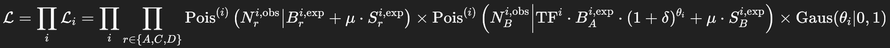

# End-to-end optimized CLs Loss for the 3D ABCDisCoTEC method

Fully differentiable **CLs** loss for a 3D **ABCD** (Double-DisCo-based) method with non‑closure optimization through live estimation and implicit differentiation through profile‑likelihood fits via pure pytorch implementation.

This repository provides a PyTorch module `CLsLoss` that you can plug into your own training loop of your Double DisCo method.

> **Status:** first research prototype — numerically sensitive. To be used in combination with BCE and resonant-feature-binned closure contrained losses in the Modified Differential Multiplier Method.

---

## What it does

- Takes **two DNN scores** and forms **ABCD** regions using **smooth sigmoid gates** so the region assignment is differentiable.
- Builds **binned histograms** of a final discriminant (e.g. the resonant observable) separately for **signal** and **background** in regions **A,B,C,D**.
- Implements the likelihood



with a bin-wise **non‑closure uncertainty** \((1+`δ`)\) constrained via **nuisance parameter** `θ`. The non‑closure `δ` is (re)estimated on the fly from observed/predicted background yields in the signal region.
- Runs three profile‑likelihood fits **inside the forward pass** (using `iminuit`) and **back‑propagates through them** using **implicit differentiation** (IFT).
- Produces the test statistic \(q_\mu\) and returns an approximate **CLs‑motivated loss** proportional to \(p_{s+b}(\sqrt{q_\mu})\).

## Install

```bash
pip install -U pip wheel
pip install torch numpy iminuit
```

## Quick start

```python
import torch
from abcd_clsloss import CLsLoss

# toy binning and ranges of your final discriminant
mt_edges = torch.linspace(200., 2000., steps=17)  # 16 bins

loss_fn = CLsLoss(mt_bin_edges=mt_edges, mt_min=200., mt_max=2000.)

# f1,f2 are DNN outputs from your own models (sigmoids not required here)
# features, target, weights_xs, data_dict come from your pipeline
# cuts = (cut_f1, cut_f2)
cls_loss = loss_fn(
    models=(model_f1, model_f2),
    features=X,
    cuts=(0.5, 0.5),
    weights_xs=w_xs,
    weights_train=w_train,  # currently unused, keep for future extensions
    target=y.to(torch.long),
    data_dict={"constraint_MT01FatJetMET": mt_scaled}  # scaled to [0,1]
)
cls_loss.backward()
```

## API

`CLsLoss(mt_bin_edges, mt_min, mt_max, int_lumi=117100, epsilon=1e-6, steepness=20, num_retries=5)`

- **mt_bin_edges**: 1D tensor of bin edges for the final discriminant histogram.
- **mt_min / mt_max**: de‑normalization of an input scaled to `[0,1]` before binning.
- **int_lumi**: scaling for histogram counts (your training weights are interpreted as cross‑sections).
- **steepness**: controls softness of the ABCD gates; larger ⇒ more step‑like.
- **num_retries**: reserved for future retry strategies around fit failures.

### Inputs to `forward`

- `models`: tuple of two modules `(f1_model, f2_model)` that each map `features -> score`.
- `features`: tensor batch passed to both models.
- `cuts`: `(cut1, cut2)` thresholds for ABCD.
- `weights_xs`: per‑event weights (e.g. xs * k‑factors / Ngen).
- `weights_train`: reserved (not used in this version).
- `target`: 0 for background, 1 for signal.
- `data_dict['constraint_MT01FatJetMET']`: final discriminant scaled to `[0,1]` (will be mapped to `[mt_min, mt_max]`).

## Notes on stability

- The forward pass runs several small `iminuit` fits. They’re fast for \(\mathcal{O}(10^1\!-\!10^2)\) bins but can be stiff.
- We regularize/invert an approximate Hessian (Jacobian of the stationarity conditions) with a small ridge term; tweak `lambd` in the code if needed.
- Binning aggregates the whole dataset enabling **full‑batch** training to avoid mini‑batch biases commonly seen with distance‑correlation/closure losses.

## Citation

If this helps your work, please cite the repository.
